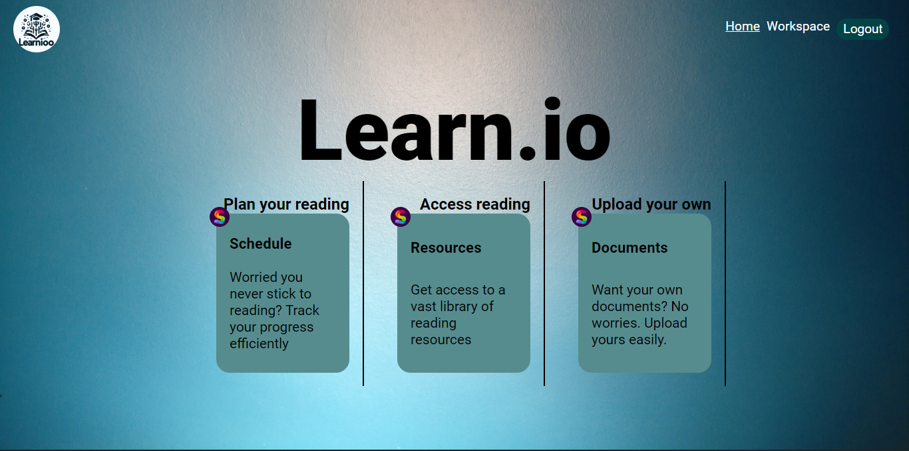

# LEARN IOO

This is my final web stack ALX project portfolio marking end of backend specialization.
Learnioo is an AI powered web application that enables users to chat with theire reading resources.

This web application allows you to:
- Plan your reading and stick to your readin schedule.
- Access reading resources
- Upload your documents and chat with them using an AI assistant.

## Technnologies used
The stack used is the **MERN STACK**, that is, MongoDB, ExpressJS, ReactJS and NodeJS.